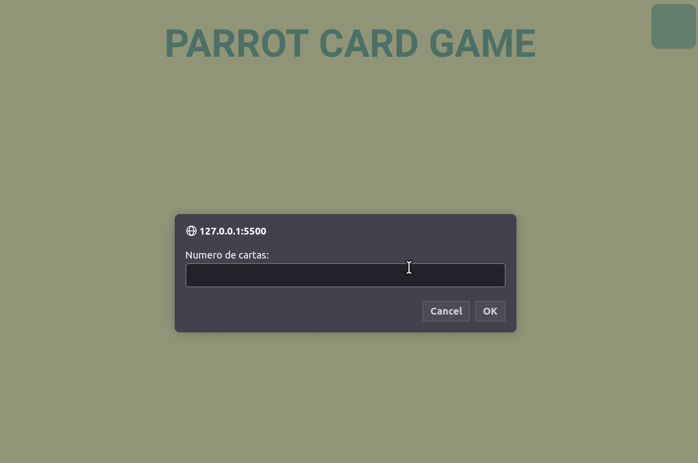

# Parrots

A simple memory game using HTML, CSS and JavaScript

Try it now at https://gpsign.github.io/parrots/

## About

This is an web application to play the classic memory game, this time themed around parrots! Below are the implemented features:

- Choose an even number from 4 to 14 cards
- In-game timer
- How much cards you turned at the end
- Start a new game by typing "y" at the end. Type "n" to stay at the end screen

## Technologies

The following tools were used in the construction of the project: 

